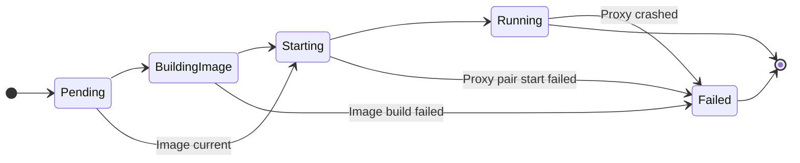

# ContainerNetworkTunnelProxy API Specification

## Overview

The `ContainerNetworkTunnelProxy` API provides a mechanism to create network tunnel proxy pairs that enable communication between clients on a container network and servers on the host network. Each proxy pair consists of:

- **Server Proxy**: Runs as a host process and handles connections to host-side servers
- **Client Proxy**: Runs as a container connected to a specific container network and accepts client connections

## API Definition

Refer to `(repo root)/api/v1/container_network_tunnel_proxy_types.go`

## ContainerNetworkTunnelProxy controller implementation

### Object data verification 

#### ContainerNetworkTunnelProxy.Spec verification

1. ContainerNetworkName must be set (not empty).
2. ContainerNetworkName cannot change during object lifetime.
3. BaseImage, if set, cannot change during object lifetime.

#### ContainerNetworkTunnelProxy.Spec.Tunnels and TunnelConfiguration verification

1. Each tunnel that is part of Spec.Tunnels must have a unique name.
2. TunnelConfiguration.ServerPort must be set.

    > Note: re-definition of TunnelConfiguration is allowed. If a TunnelConfiguration is updated, the old tunnel will be stopped gracefully and the new tunnel (with the same Name) will be prepared.

### State handling

> See [Handling object deletion](#handling-object-deletion) to learn what states allow deletion of a ContainerNetworkTunnelProxy instance.

1. Pending (initial) state
   
   Ensures that the object has the finalizer set.
   Verifies the preconditions for transitioning to BuildingImage state:
   - Verifies that the referenced ContainerNetwork exists and its state is "Running" (i.e. it was created with the orchestrator). If true, transition to BuildingImage state. If not, remain in Pending state and schedule additional reconciliation.
   - The ContainerNetworkTunnelProxy also stays in Pending state if container runtime is unhealthy.

2. BuildingImage state

   Check if a image already exists. The image will use a well-known name e.g. dcptun_developer_ms, and a tag that corresponds to the version of the dcptun binary. If the version starts with "dev" (e.g. "dev_123456"), dcptun should compute its hash and compare it with the hash that comes after "dev"; if there is no match, a new image should be created.
   The image is built from a temporary Dockerfile, using dcptun_c binary and base image specified in the Spec. Assume that the dcptun_c binary is under `ext/bin` (`DcpBinDir`) subfolder of DCP installation.
   If the image build is successful, transition to Starting state. Otherwise transition to Failed state.
   There is no need to "clean up" old images.

3. Starting state.

   Create the container for the client proxy. The proxy should be bound to all interfaces, and the ports (control port and data port) are well-known, e.g. 36672 and 36673.
   Attach the container to the network, removing it from default bridge network.
   Start the container, mapping the control and data ports to host (host loopback interface).
   Read the (auto)mapped ports.
   Start the server proxy, passing the client control and data ports and addresses. Set up log files as necessary.
   Update status as necessary.
   If an error occurs transition to Failed state. Otherwise proceed to Running state.

4. Running state.

   Apply (prepare tunnels) described by Spec.Tunnels and memorize existing tunnels and their configs.
      If a tunnel with the same name, but different configuration already exists, delete exiting tunnel and prepare new one,
      with modified configuration.
   Update Spec.TunnelStatuses as necessary
   Watch for changes to tunnel configuration (Spec.Tunnels property) and make corresponding changes to the proxy pair as necessary.
   Watches for changes to Services. For each tunnel configuration, to successfully prepare a tunnel, the server service must exist and be in Ready state, and the client service must exist (so that the controller can publish an Endpoint for it).
   Monitor the server and client proxies (client running as container). If either of them fails, transition to Failed state.

5. Failed state.

   This is terminal state, reached when there is unrecoverable error during client proxy container image build, proxy pair creation, or proxy execution.
   Upon reaching the state, the controller should perform an associated resource cleanup similar to the cleanup during object deletion, see below.

### Handling object deletion

ContainerNetworkTunnelProxy object can be deleted when it is in any state, and each reconciliation loop execution should check whether a deletion is requested. 

If the object is in BuildingImage or Starting state, all activity associated with that state must complete before the object can be cleaned up and deleted.

ContainerNetworkTunnelProxy object cleanup and deletion involves following steps:
1. Deleting all tunnels enabled by the proxy pair (if any).
2. Stopping the client proxy container and the server proxy process.
3. Removing the finalizer from the object so that the API server can complete the object deletion.
4. Removing any temporary files associated with the object (in particular, files for storing server proxy logs) and removing the in-memory data for the object.

### Additional considerations for ContainerNetworkTunnelProxy controller.

1. Should we have a "system log" subresource for ContainerNetworkTunnelProxy, for reporting errors from proxy creation and tunnel enablement?
   
   Answer: probably yes. It will be especially helpful when handling the Pending state, where a lot of pre-conditions need to be satisfied before the tunnel gets going. 

2. Should we add a user-friendly name to the tunnel request and tunnel spec Protobuf definitions (dcptun.proto), so that logs from the proxy refer to that user-friendly name and allow for easier tunnel identification?

3. With the introduction of the tunnel we will now have a "system container" concept, namely for running client-side proxies as containers. This is similar to "system process" concept that we use to gather container events for example. Should we enhance `dcpproc` monitor utility to be able to monitor and clean up "system containers" as well?
   
   Answer: tentatively yes. Consider running the client proxy container with `-rm` option, so that the only thing that `dcpproc` needs to do is to stop the container.

