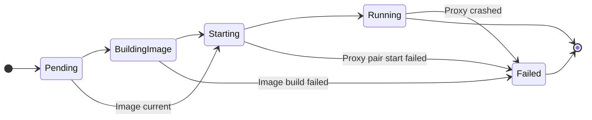

# ContainerNetworkTunnelProxy API Specification

## Overview

The `ContainerNetworkTunnelProxy` API provides a mechanism to create network tunnel proxy pairs that enable communication between clients on a container network and servers on the host network. Each proxy pair consists of:

- **Server Proxy**: Runs as a host process and handles connections to host-side servers
- **Client Proxy**: Runs as a container connected to a specific container network and accepts client connections

## API Definition

### ContainerNetworkTunnelProxy Resource

```go
// ContainerNetworkTunnelProxy represents a tunnel proxy pair that handles multiple tunnels
// between a container network and host network.
// +kubebuilder:object:root=true
// +kubebuilder:subresource:status
// +k8s:openapi-gen=true
// +kubebuilder:resource:scope=Cluster
type ContainerNetworkTunnelProxy struct {
    metav1.TypeMeta   `json:",inline"`
    metav1.ObjectMeta `json:"metadata,omitempty"`

    Spec   ContainerNetworkTunnelProxySpec   `json:"spec,omitempty"`
    Status ContainerNetworkTunnelProxyStatus `json:"status,omitempty"`
}
```

### ContainerNetworkTunnelProxy spec

```go
// ContainerNetworkTunnelProxySpec defines the desired state of a ContainerNetworkTunnelProxy.
// +k8s:openapi-gen=true
type ContainerNetworkTunnelProxySpec struct {
    // Reference to the ContainerNetwork that the client proxy should connect to.
    // This field is required and must reference an existing ContainerNetwork resource.
    ContainerNetworkName string `json:"containerNetworkName"`

    // List of tunnels to prepare. Each tunnel enables clients on the container network 
    // to connect to a server on the host (establish a tunnel stream).
    // +listType=atomic
    Tunnels []TunnelConfiguration `json:"tunnels,omitempty"`

    // Base container image to use for the client proxy container.
    // Defaults to mcr.microsoft.com/azurelinux/base/core:3.0 if not specified.
    // +optional
    BaseImage string `json:"baseImage,omitempty"`
}

// TunnelConfiguration defines a single tunnel enabled by a ContainerNetworkTunnelProxy.
// +k8s:openapi-gen=true
type TunnelConfiguration struct {
    // User-friendly name for the tunnel (used in status reporting and debugging).
    // Must be unique within the ContainerNetworkTunnelProxy.
    Name string `json:"name"`

    // Address of the server on the host that clients will be tunneled to.
    // Defaults to "localhost" if not specified.
    // +optional
    ServerAddress string `json:"serverAddress,omitempty"`

    // Port of the server on the host that clients will be tunneled to.
    ServerPort int32 `json:"serverPort"`

    // Address that the client proxy will bind to on the container network
    // Defaults to "0.0.0.0" (all interfaces) if not specified.
    // +optional
    ClientProxyAddress string `json:"clientProxyAddress,omitempty"`

    // Port that the client proxy will use on the container network.
    // If set to 0 or not specified, a random port will be assigned.
    // +optional
    ClientProxyPort int32 `json:"clientProxyPort,omitempty"`
}
```

### ContainerNetworkTunnelProxy status

```go
// ContainerNetworkTunnelProxyStatus defines the current state of a ContainerNetworkTunnelProxy.
// +k8s:openapi-gen=true
type ContainerNetworkTunnelProxyStatus struct {
    // Overall state of the tunnel proxy pair.
    // +kubebuilder:default:="Pending"
    State ContainerNetworkTunnelProxyState `json:"state,omitempty"`

    // Status of individual tunnels within the proxy pair.
    // +listType=atomic
    TunnelStatuses []TunnelStatus `json:"tunnelStatuses,omitempty"`

    // Monotonically increasing version number of the tunnel configuration that was applied to the proxy pair.
    // Can be used by clients changing tunnel configuration (Tunnels property) to learn that the new configuration has become effective.
    TunnelConfigurationVersion int32 `json:"tunnelConfigurationVersion,omitempty"`

    // Container ID of the running client proxy container.
    ClientProxyContainerID string `json:"clientProxyContainerId,omitempty"`

    // Server proxy process ID.
    ServerProxyProcessID *int64 `json:"serverProxyProcessId,omitempty"`

    // Server proxy process startup timestamp.
    ServerProxyStartupTimestamp metav1.MicroTime `json:"serverProxyStartupTimestamp,omitempty"`

    // The path of a temporary file that contains captured standard output data from the server proxy process.
	ServerProxyStdOutFile string `json:"serverProxyStdOutFile,omitempty"`

	// The path of a temporary file that contains captured standard error data from the server proxy process.
	ServerProxyStdErrFile string `json:"serverProxyStdErrFile,omitempty"`

    // Published (host) port for client proxy control endpoint.
    ClientProxyControlPort int32 `json:"clientProxyControlPort,omitempty"`

    // Published (host) port for client proxy data endpoint.  
    ClientProxyDataPort int32 `json:"clientProxyDataPort,omitempty"`

   // Server proxy control port (for controlling the proxy pair).
    ServerProxyControlPort int32 `json:"serverProxyControlPort,omitempty"`

}

type ContainerNetworkTunnelProxyState string

const (
   // The same as ContainerNetworkTunnelProxyStatePending. 
   // May be encountered when ContainerNetworkTunnelProxy status has not been initialized yet.
    ContainerNetworkTunnelProxyStateEmpty ContainerNetworkTunnelProxyState = ""

    // Initial state - proxy pair is being created.
    ContainerNetworkTunnelProxyStatePending ContainerNetworkTunnelProxyState = "Pending"
    
    // Building the client proxy container image.
    ContainerNetworkTunnelProxyStateBuildingImage ContainerNetworkTunnelProxyState = "BuildingImage"
    
    // Starting the proxy pair.
    ContainerNetworkTunnelProxyStateStarting ContainerNetworkTunnelProxyState = "Starting"

    // Proxy pair is ready with all tunnels operational.
    ContainerNetworkTunnelProxyStateRunning ContainerNetworkTunnelProxyState = "Running"

    // Proxy pair encountered an unrecoverable error, either during startup, or during execution.
    ContainerNetworkTunnelProxyStateFailed ContainerNetworkTunnelProxyState = "Failed"
)

// TunnelStatus represents the status of a single tunnel within the proxy pair
// +k8s:openapi-gen=true
type TunnelStatus struct {
    // Name of the tunnel (matches TunnelConfiguration.Name).
    Name string `json:"name"`

    // Internal tunnel ID assigned by the proxy pair.
    TunnelID uint32 `json:"tunnelId,omitempty"`

    // Current state of the tunnel.
    State TunnelState `json:"state"`

    // Human-readable explanation for why the tunnel preparation failed (if it did).
    ErrorMessage string `json:"errorMessage,omitempty"`

    // The timestamp for the status (last update).
    Timestamp metav1.MicroTime `json:"timestamp"`
}

type TunnelState string

const (
    // Tunnel is ready and accepting connections.
    TunnelStateReady TunnelState = "Ready"
    
    // Tunnel preparation failed, see ErrorMessage for details.
    TunnelStateFailed TunnelState = "Failed"
)
```

## ContainerNetworkTunnelProxy controller implementation

### Object data verification 

#### ContainerNetworkTunnelProxy.Spec verification

1. ContainerNetworkName must be set (not empty).
2. ContainerNetworkName cannot change during object lifetime.
3. BaseImage, if set, cannot change during object lifetime.

#### ContainerNetworkTunnelProxy.Spec.Tunnels and TunnelConfiguration verification

1. Each tunnel that is part of Spec.Tunnels must have a unique name.
2. TunnelConfiguration.ServerPort must be set.

    > Note: re-definition of TunnelConfiguration is allowed. If a TunnelConfiguration is updated, the old tunnel will be stopped gracefully and the new tunnel (with the same Name) will be prepared.

### State handling


> See [Handling object deletion](#handling-object-deletion) to learn what states allow deletion of a ContainerNetworkTunnelProxy instance.

1. Pending (initial) state
   
   Ensures that the object has the finalizer set.
   Verifies that the referenced ContainerNetwork exists and its state is "Running" (i.e. it was created with the orchestrator).
   If not, remain in Pending state and schedule additional reconciliation.
   If the ContainerNetwork and underlying resource exists, transition to BuildingImage state.

   The ContainerNetworkTunnelProxy also stays in Pending state if container runtime is unhealthy.

2. BuildingImage state

   Check if a image already exists. The image will use a well-known name e.g. dcptun_developer_ms, and a tag that corresponds to the version of the dcptun binary. If the version starts with "dev" (e.g. "dev_123456"), dcptun should compute its hash and compare it with the hash that comes after "dev"; if there is no match, a new image should be created.
   The image is built from a temporary Dockerfile, using dcptun_c binary and base image specified in the Spec.
   If the image build is successful, transition to Starting state. Otherwise transition to Failed state.
   There is no need to "clean up" old images.

3. Starting state.

   Create the container for the client proxy. The proxy should be bound to all interfaces, and the ports (control port and data port) are well-known, e.g. 36672 and 36673.
   Attach the container to the network, removing it from default bridge network.
   Start the container, mapping the control and data ports to host (host loopback interface).
   Read the (auto)mapped ports.
   Start the server proxy, passing the client control and data ports and addresses. Set up log files as necessary.
   Update status as necessary.
   If an error occurs transition to Failed state. Otherwise proceed to Running state.

4. Running state.

   Apply (prepare tunnels) described by Spec.Tunnels and memorize existing tunnels and their configs.
      If a tunnel with the same name, but different configuration already exists, delete exiting tunnel and prepare new one,
      with modified configuration.
   Update Spec.TunnelStatuses as necessary
   Watch for changes to tunnel configuration (Spec.Tunnels property) and make corresponding changes to the proxy pair as necessary.
   Monitor the server and client proxies (client running as container). If either of them fails, transition to Failed state.

5. Failed state.

   This is terminal state, reached when there is unrecoverable error during client proxy container image build, proxy pair creation, or proxy execution.
   Upon reaching the state, the controller should perform an associated resource cleanup similar to the cleanup during object deletion, see below.

### Handling object deletion

ContainerNetworkTunnelProxy object can be deleted when it is in any state, and each reconciliation loop execution should check whether a deletion is requested. 

If the object is in BuildingImage or Starting state, all activity associated with that state must complete before the object can be cleaned up and deleted.

ContainerNetworkTunnelProxy object cleanup and deletion involves following steps:
1. Deleting all tunnels enabled by the proxy pair (if any).
2. Stopping the client proxy container and the server proxy process.
3. Removing the finalizer from the object so that the API server can complete the object deletion.
4. Removing any temporary files associated with the object (in particular, files for storing server proxy logs) and removing the in-memory data for the object.

### Additional considerations for ContainerNetworkTunnelProxy controller.

1. Should we have a "error log" subresource for ContainerNetworkTunnelProxy, for reporting errors from proxy creation and tunnel enablement?

2. Should we add a user-friendly name to the tunnel request and tunnel spec Protobuf definitions (dcptun.proto), so that logs from the proxy refer to that user-friendly name and allow for easier tunnel identification?

3. With the introduction of the tunnel we will now have a "system container" concept, namely for running client-side proxies as containers. This is similar to "system process" concept that we use to gather container events for example. Should we enhance `dcpproc` monitor utility to be able to monitor and clean up "system containers" as well?
   
   Answer: tentatively yes. Consider running the client proxy container with `-rm` option, so that the only thing that `dcpproc` needs to do is to stop the container.

